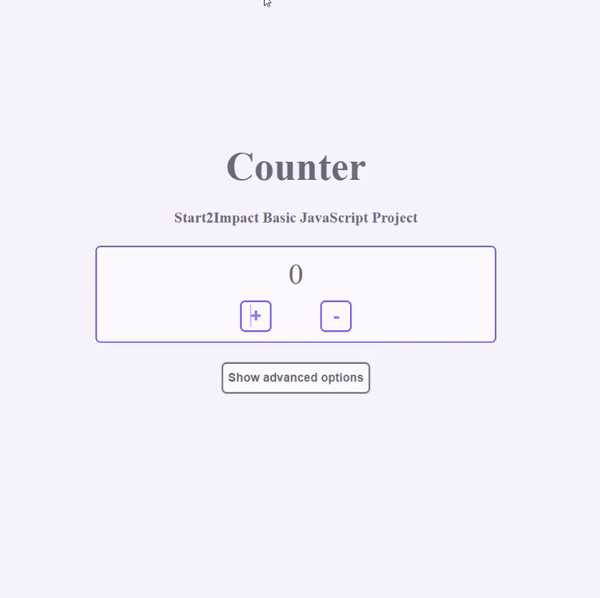

# JavaScript Counter

My first JavaScript project, created for [Start2Impact](https://www.start2impact.it/) BASIC JS section.  
You can visit the site [here](https://js-basic-s2i-marcolovato.netlify.app/){:target="_blank"}.

## Project requirements 

- Upon entering the page, the counter must have the value 0
- There must be two buttons : + and -

## Additional options

These are options added but not required for the task :

- Reset counter
- Calculator-like system that accepts an input

### Small detail

Since the project was to prove JS skills, I did not consider it necessary to make the site responsive, so it will only be displayed correctly from tablet-desktop devices.